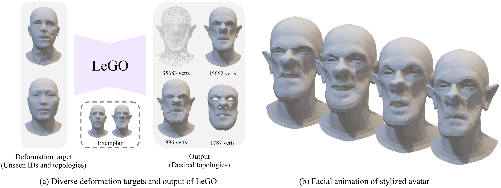
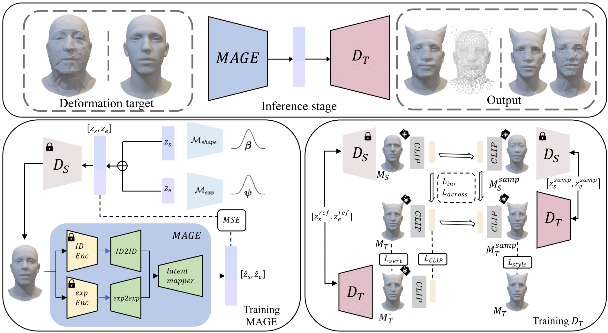

# [⭐️ CVPR 2024 Highlight ⭐️] LeGO: Leveraging a Surface Deformation Network for Animatable Stylized Face Generation with One Example
[](https://arxiv.org/abs/2403.15227)
[](https://kwanyun.github.io/lego/)
[](https://colab.research.google.com/drive/17PWpoy-UruGDTPum_MYZ-sa6dhGlXXQM?usp=sharing)


### [[Project Page]](<https://kwanyun.github.io/lego/>) [[arXiv]](<https://arxiv.org/abs/2403.15227>) [[Paper]](paper/LeGO_CVPR2024.pdf) 



## Overview
Recent advances in 3D face stylization have made significant strides in few-shot to zero-shot settings. However, the degree of stylization achieved by existing methods often falls short for practical applications because they primarily rely on statistical 3D Morphable Models (3DMM) with limited variations. To address this, we propose a method capable of producing highly stylized 3D face models with desired topology. Our approach trains a surface deformation network with 3DMM and translates its domain to the target style using a paired exemplar. Stylization of the 3D face mesh is achieved by mimicking the style of the target using a differentiable renderer and directional CLIP losses. Additionally, during inference, we utilize a Mesh Agnostic Encoder (MAGE) that takes a deformation target, a mesh with diverse topologies, as input to the stylization process and encodes its shape into our latent space. The resulting stylized face model can be animated using commonly used 3DMM blend shapes. We demonstrate our method's effectiveness through a series of quantitative and qualitative evaluations, showcasing its ability to produce highly stylized face meshes according to a given style and output them in desired topologies. We also present example applications of our method, including image-based stylized avatar generation, linear interpolation of geometric styles, and facial animation of stylized avatars.



## Features
- **Pretraining DS**: Trained to generate versatile head meshes with different shapes and expressions using the FLAME model.
- **Fine-tuning DT**: Implements one-shot stylization schemes for 3D face meshes via domain adaptation and hierarchical rendering.
- **Training Mesh Agnostic Encoder (MAGE)**: Encodes diverse mesh topologies into a topology-invariant latent space for stylization.

## Setup Instructions

### Requirements
- Python 3.8 or later
- PyTorch 1.10.1
- Kaolin 0.13.0
- Other dependencies as specified in `require.sh`

### Installation
1. **Clone the Repository**:
    ```bash
    git clone https://github.com/your-repo/LeGO_3D_Stylization.git
    cd LeGO_3D_Stylization
    ```
2. **Download MICA and Modifications**:
    - During the training process, we utilize the FLAME module from the [MICA](https://github.com/Zielon/MICA) repository.
    ```bash
    git clone https://github.com/Zielon/MICA.git
    cd MICA
    bash ./install.sh
    ```
    - Place `mica.py` in the MICA directory, which you can download from the following link:
    [mica.py](https://drive.google.com/file/d/1p0HTYdYCJTuonMiOMK2BB7m1wA-7qoq7/view?usp=drive_link)
    - Replace the `models/` directory in the MICA directory with the folder provided from this [link](https://drive.google.com/drive/folders/1pkEPgCqMm6jW1OaR_Op_3PdVCaA8_xbH?usp=sharing)
    - Download [FLAME2020](https://flame.is.tue.mpg.de/) and place it in the `data/` directory.
    - Place `mica.tar` under `LeGO_3D_Face_Stylization/`.

3. **Install Dependencies**:
    ```bash
    bash ./require.sh
    ```

4. **Download Checkpoints**:
    - Download the pretrained DS checkpoint from the [model_epoch_0400.pth](https://drive.google.com/drive/folders/1II18BGnK65hY54ATc26LaSAOlReejqHk?usp=sharing) and place it in the `ckpt` directory.
    - Download the pretrained DT checkpoint folder from the [/styles](https://drive.google.com/drive/folders/1II18BGnK65hY54ATc26LaSAOlReejqHk?usp=sharing) and place it in the `ckpt` directory.

## Usage

### Fine-tuning DT
To finetune DT for stylization:
```bash
python oneshot_train.py --config ./configs/fine-tuning.yml   --name_data <style>
```
All styles to be trained are available under `train_exemplar/style` 

### Inference
In the provided code setup, the encoder implementation has not been included. Instead, the latent representations (available in `/inference_input`) are precomputed using the pretrained encoder and supplied as direct inputs for inference. The 3D face data necessary for the process is available in the `/test_data` directory.


**Generate Stylized 3D Face**
```bash
python inference.py --config ./configs/inference.yml --styles <list of styles>
```
All styles for the inference are available under `train_exemplar/style` 

**Generate Stylized 3D Face with a Desired Topology**  

You can generate a stylized 3D face by selecting one of the following available topologies:  
- `mask`  
- `simplified`  
- `FLAME`  
- `looped_modified`
```bash
python inference_desired_topology.py --config ./configs/inference_desired_topology.yml --styles <list of styles> --topology <desired topology>
```

**Generate Stylized 3D Face with an Expression**  

You can generate a stylized 3D face by selecting one of the following available expressions:  
- `sad`  
- `happy`  
- `angry`  
- `surprised`
```bash
python animation.py --config ./configs/animation.yml --styles <style> --expression <expression>
```

# :mailbox_with_mail: Contact

For any inquiries, please contact the authors:

- **Soyeon Yoon**: [thoyeony@kaist.ac.kr](mailto:thoyeony@kaist.ac.kr)
- **Kwan Yun**: [yunandy@kaist.ac.kr](mailto:yunandy@kaist.ac.kr)

# :mega: Citation
```bash
@article{yoon2024lego,
  title={LeGO: Leveraging a Surface Deformation Network for Animatable Stylized Face Generation with One Example},
  author={Yoon, Soyeon and Yun, Kwan and Seo, Kwanggyoon and Cha, Sihun and Yoo, Jung Eun and Noh, Junyong},
  journal={arXiv preprint arXiv:2403.15227},
  year={2024}
}
```

# Credit
This implementation builds upon <Deformed Implicit Field: Modeling 3D Shapes with Learned Dense Correspondence> ([Dif-net](https://github.com/microsoft/DIF-Net))and <Deep Deformable 3D Caricature with Learned Shape Control> ([DD3C](https://github.com/ycjungSubhuman/DeepDeformable3DCaricatures/tree/main)). Rendering code using kaolin has been adapted from [Text2Mesh](https://github.com/threedle/text2mesh).  We thank the authors for sharing the code for the work publicly.

